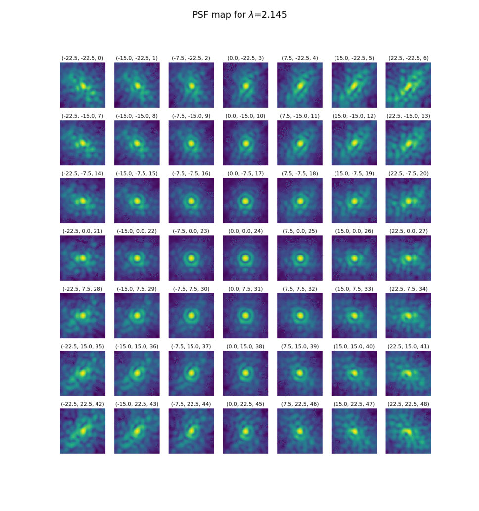

PSFs from the MAORY Consortium
==============================

Here you find links to the October 2017 release of MAORY PSFs for both the SCAO
and MCAO modes, formatted for use by the new SimCADO v1.0 package.

.. warning:: MAORY PSFs are not in the public domain

    MAORY has only released these PSFs for internal use by the MICADO
    consortium. If you wish to publish anything using these PSFs, please
    **contact the MAORY team** regarding their publication policy.

    A short version of the MAORY publication policy is given below

.. important:: MAORY PSFs follow a new file format (FV-PSFs)

    **Only SimCADO v0.6 and above can read the FV-PSF files.**

    The field-varying PSF FITS format was developed for the revamped SimCADO
    v1.0 release, and hence is not backwards compatible with versions of SimCADO
    below v0.6. SimCADO v0.6 (latest) contains a back-ported version of the
    field-varying PSF code and **can** read the FV-PSF format.

MCAO PSFs
---------

The MCAO PSFs provide monochromatic PSFs kernels for IJHK filters at
(0.86, 1.245, 1.635, 2.145) micron and for 2 positions in the field: Near a
guide star (LGS or NGS), and far from a guide star.

* Wide-field (4mas / pixel) mode

  `<http://www.univie.ac.at/simcado/InstPkgSvr/psfs/MAORY_MCAO_FVPSF_4mas_20181203.fits>`_

* Zoom (1.5mas / pixel) mode

  `<http://www.univie.ac.at/simcado/InstPkgSvr/psfs/MAORY_MCAO_FVPSF_1.5mas_20181203.fits>`_

SCAO PSFs
---------

    A GIF showing the evolution of the SCAO PSFs generated by the MAORY consortium with 
    wavelength, covering the range (2.15, 1.65, 1.25, 1.05, 0.86) micron. The PSFs cover
    a 45" field of view. (+/- 22.5 arcsec from the optical axis).

The SCAO PSFs provide monochromatic PSFs kernels for IzJHK filters at
(0.86, 1.02, 1.245, 1.635, 2.145) micron and for 49 positions in the field. The
positions are a 7x7 grid centred on the optical axis (0, 0), and spaced
7.5 arcsec in each direction - i.e. at (-22.5, -15, -7.5, 0, 7.5, 15, 22.5)
arcsec in each direction.

Each extension is a FITS image cube corresponds to one of the wavelengths noted
above, with each layer in the cube corresponding to PSF at the coordinates on
the field. The NGS is assumed to be on-axis.

PSF kernels are found in extensions 2 to 6. Extension 1 contains a table of the
coordinates with the corresponding cube layer index for the PSF kernel which
belongs at this coordinate.

* Wide-field (4mas / pixel) mode

  `<http://www.univie.ac.at/simcado/InstPkgSvr/psfs/MAORY_SCAO_FVPSF_4mas_20181203.fits>`_

* Zoom (1.5mas / pixel) mode

  `<http://www.univie.ac.at/simcado/InstPkgSvr/psfs/MAORY_SCAO_FVPSF_1.5mas_20181203.fits>`_

MAORY Publication policy
------------------------

.. important:: MAORY publication policy

    As of 29. March 2019. Source: MAORY PSF website

    "Publication making use of these PSF are welcome. However, all the
    publications are subject to the following MAORY publication policy:

    * For referred publications the Editorial Board will indicate the names of
      the co-authors from the MAORY team.

    * For conference proceedings the Editorial Board shall be informed of any
      submitted abstract and publication.

    * The Editorial Board may suggest additional names of co-authors to be added
      in the final publication.

    By default a core of names shall be added to the list of authors: this core
    shall include the PI (as representative of the Consortium and of the Lead
    Institute), the PM, the co-I representative of INSU-IPAG.“
